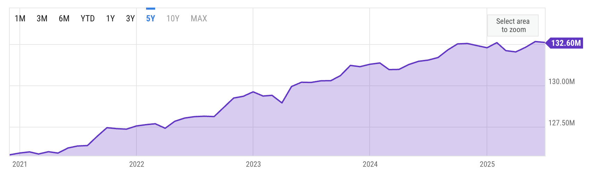

<!--
id: "dingo-dig-suitcase"
created: "Sun Nov 23 10:12:52 2025"
attribution: TBA
status: "sketch"
chapter: 1
mode: "exercise"
-->



::: {#exr-dingo-dig-suitcase}
In the new-housing example in the text, a claim was made that the number of new households increases by about 1% a year. @fig-household-formation shows the data on which this claim was made.

::: {#fig-household-formation}

Number of US households versus time. 
[Source](https://ycharts.com/indicators/us_households)

:::

Do the calculation of household growth yourself, based on these data. Explain your calculation and whether the result agrees with the claim in the text.

`r devoirs::devoirs_text("dds52")`

:::
 <!-- end of exr-dingo-dig-suitcase -->
