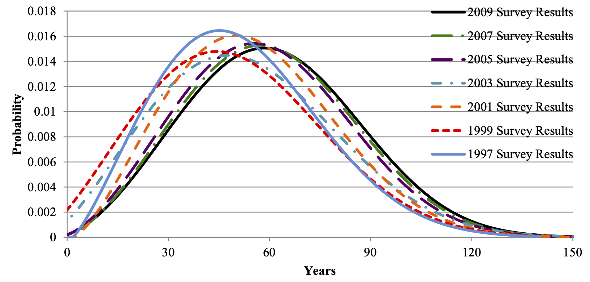

<!--
id: "hamster-hurt-lamp"
created: "Sun Aug 24 12:01:40 2025"
attribution: TBA
status: "ready-to-use"
chapter: 1
mode: "exercise"
-->



::: {#exr-hamster-hurt-lamp}
Many people experience the symptoms of a housing shortage: splitting up apartments to accomodate roommate groups; financial stress due (in part) to high rents; deferring life decisions such as having children; living in deteriorating, aging buildings, and so on.

We're used to thinking about people in terms of lifespan, but it is also useful to think about buildings that way. City and local governments keep detailed information about the housing stock, largely for tax purposes. Services like <zillow.com> have data readily available to the public.

**Question**: What about the houses listed on Zillow might presented a view biased to houses in better condition? 

`r devoirs::devoirs_text("hhl-1-wke")`

A life-cycle assessment of a sample of US houses and apartments by [Aktas and Bilic (2012)](https://raw.githubusercontent.com/dtkaplan/QR-A/main/www/Residential-building-outline.pdf) produced the following graphic about how long houses and apartments remain habitable.

::: {#fig-building-lifetime}

"Lifetime distribution of residential buildings calculated from multiple American Housing Survey microdata," from Aktas and Bilic 2012.
:::

**Question**: Is the graph consistent with the claim that 7% of US housing stock was built before 1920?

`r devoirs::devoirs_text("hhl-2-wke")`

**Question**: Speculate on what might account for the rightward shift of the curve over the ten year period considered. Consider these two hypotheses:

i. house building techniques have been improving. (When would they have had to improve to produce the curve shift?)
ii. the current housing shortage has resulted in buildings being used after the time that they would have been replaced were there no housing shortage?

`r devoirs::devoirs_text("hhl-3-wke")`

<!-- ANOTHER DATUM: "In the U.S., the typical depreciation rate for a residential apartment building is 3.636% per year. The IRS requires that the cost of the building (minus the value of the land) be depreciated over a period of 27.5 years using the straight-line method." from AI 

I'M HEADING TOWARD a later exercise referring to Chapter 8 or 9 in *short introduction to demography which will ask students to outline their own design for a model that would enable us to construct an index of how successfully new housing suitable for different income levels is becoming available to accomodate growth and the retirement of old buildings.
-->

:::
 <!-- end of exr-hamster-hurt-lamp -->
