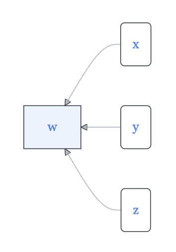

<!--
id: "pony-meet-window"
created: "Sun Oct 19 08:38:08 2025"
attribution: TBA
status: "ready-to-use"
chapter: 2
mode: "exercise"
-->




::: {#exr-pony-meet-window}



```{mermaid}
graph RL
  A(x)
  B(y)
  C[w]
  D(z)
  A --> C
  B --> C
  D --> C
  
classDef exogenous fill:#fff,stroke-width:1px

class A exogenous
class B exogenous
class D exogenous
```

In the above diagram ...

1. Which quantities are endogenous?

```{mcq}
#| label: dddd
#| inline: true
1. w [correct hint: Correct! It's in a sharp-cornered box.]
2. x [hint: Sorry. A round-cornered box indicates an exogenous quantity.]
3. y [hint: Sorry. A round-cornered box indicates an exogenous quantity.]
4. z [hint: Sorry. A round-cornered box indicates an exogenous quantity.]
5. None of them.
```

2. How many functions are indicated by the diagram?

```{mcq}
#| label: dddd-2
#| inline: true
1. 0
1. 1 [correct hint: Right! There's only one sharp-cornered box.]
2. 2 
3. 3 
4. 4 
```

3. Which quantity is the output of a function?

```{mcq}
#| label: dddd-3
#| inline: true
1. w [correct hint: Good! The square box stands for a function with the inputs being indicated by the inward-pointing arrows.]
2. x 
3. y 
4. z 
5. None of them.
```
:::
 <!-- end of exr-pony-meet-window -->
