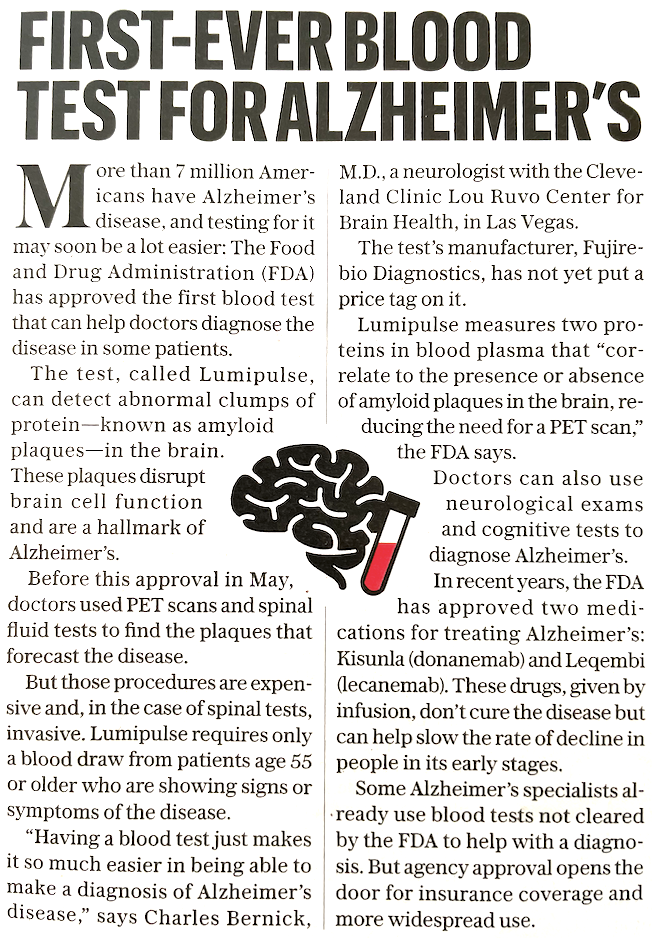

<!--
id: "dolphin-see-pants"
created: "Tue Jul 15 11:39:36 2025"
attribution: TBA
status: "sketch"
chapter: 4
mode: "reading-question"
-->



::: {#exr-dolphin-see-pants}
The following short article appeared in the *AARP Bulletin* for July/August 2025 about US government approval of a new, inexpensive, and non-invasive test for Alzheimer's disease.

There is an unexplained restriction described in the fourth paragraph:

> "Lumipulse requires only a blood draw from patients age 55 or older who are showing signs or symptoms of the disease."

Explain what might justify the age and sign-or-symptom restriction.

<!-- Opening answer: 03_Risk-2MY -->
::: {.callout-tip collapse=true `r devoirs:::answer_style()`}
## Answer

Some readers may see the restriction as reflecting the economics and high cost of health care. But there is a more fundamental factor involved, the false-positive rate of the test. The prevalence of Alzheimers is greater in older adults, especially those showing signs or symptoms. The higher the prevalence for a test of a given specificity, the lower the false-positive rate.

[..id..]{data-tooltip="Ans id: 03_Risk-2MY"}
:::
<!-- closing answer 03_Risk-2MY -->

:::
 <!-- end of exr-dolphin-see-pants -->
