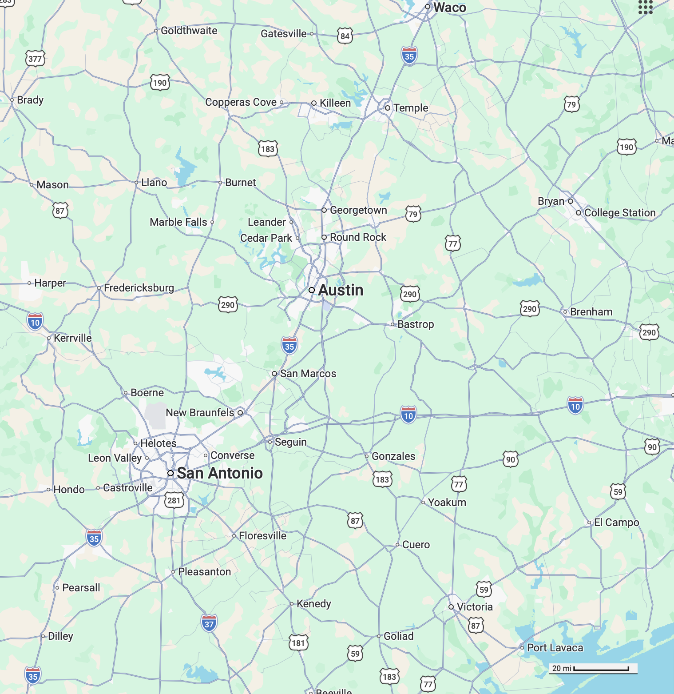

<!--
id: "cheetah-feel-teacup"
created: "Sun Dec 28 14:19:45 2025"
attribution: TBA
status: "sketch"
chapter: 5
mode: "exercise"
-->



::: {#exr-cheetah-feel-teacup}
Your prototype, autonomous, flying drone taxi has a maximum range of 100 miles. After two days of non-stop lab work in Bastrop, you direct your drone taxi to fly you to the roof of your Austin apartment building. You fall asleep. When you wake up, the taxi has landed in the middle of nowhere, batteries drained. Evidently, you are in the midst of a massive, AI-generated, apocalypse-movie-like cyber attack, which not only scrambles the navigation of your taxi, but has also silenced all forms of communication and caused everyone else to hunker down in whatever building they are closest to. You need to get back in touch in order to do something of movie importance: feed your puppy, forestall a global nuclear war, provide the antidote (which you just finished developing in Bastrop and are carrying to Austin) to a global bio-toxin outbreak, etc. All you have is a magnetic compass and the map below, which you printed out when your puppy asked you by text message where is Bastrop. 
    
From your vast familiarity with the lost-in-the-desert genre of literary endeavor, you know that it is best to pick a direction, then walk steadily in that direction until you encounter a major road (such as the ones shown on the map). You walk east. After 20 miles, you still have not come to a major road. What are the locations on the map which are most consistent with the information given. (Mark the map with several possibilities.)
    
Frustrated, tired, hungry, thirsty, and in a semi-psychotic state, you decide to turn north. After another 20 miles, you find a major road. All the road signs have been obliterated by a movie-script writer, so they are no help. What are your best guesses about where you are? (Mark these on the map, too, but in a different color than the previous marks.)
    
Explain the reasoning behind your answer.

`r devoirs::devoirs_text("RQ10-lost-in-space")`

::: {#fig-bastrop-austin}

Road map of the area surrounding Austin, TX and Bastrop, TX.
:::

:::
 <!-- end of exr-cheetah-feel-teacup -->
