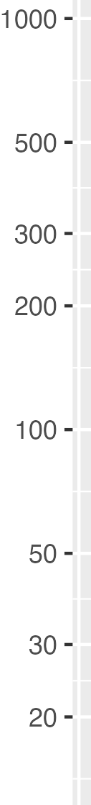

<!--
id: "lamb-speak-radio"
created: "Mon Dec 22 10:17:40 2025"
attribution: TBA
status: "ready-to-use"
chapter: 5
mode: "exercise"
-->




::: {#exr-lamb-speak-radio}

```{r}
#| echo: false
#| eval: false
#| label: C05-ydfrr
# create the four files then use graphics editor to make separate
# files for each axis
P <- ggplot(mtcars, aes(x = disp, y = hp)) + geom_blank() +
  theme_minimal()
P
ggsave("axis-linear.png", P)
P2 <- P + scale_y_log10(n.breaks = 10) + scale_x_log10()
ggsave("axis-log.png", P2)

Q <- ggplot(Engines, aes(x=stroke, y = bore)) + geom_blank()
Q2 <- Q + scale_y_log10(n.breaks = 10) + scale_x_log10()
ggsave("axis-linear2.png", Q)
ggsave("axis-log2.png", Q2)
```

```{r}
#| echo: false
#| label: C05-uhudw
set.seed(101)
idn <- function(n) {
  glue::glue("sca-{n}-{paste0(sample(letters, 5), collapse='')}")
}
scale_Q <- function(n=1, answer = "linear", type = c("linear", "magnitude")) {
  devoirs::devoirsTF(
    c(TRUE, FALSE)[which(answer == type)],
    format = paste(type, collapse = " or "),
    leed = "Which kind of scale is this?",
    id = idn(n)
  )
}
```

1.  `r scale_Q(1, "magnitude")`

-----

2. {height=40mm} `r scale_Q(2, "linear")`

-----

3.  `r scale_Q(3, "linear")`

-----

4. {height=40mm} `r scale_Q(4, "magnitude")`

-----

5.  `r scale_Q(5, "magnitude")`

-----

6. {height=40mm} `r scale_Q(6, "linear")`

-----

7.  `r scale_Q(7, "linear")`


:::
 <!-- end of exr-lamb-speak-radio -->
