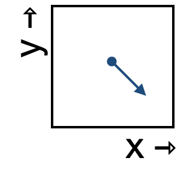

<!--
id: "lamb-rise-kitchen"
created: "Fri Feb 20 07:51:13 2026"
attribution: TBA
status: "ready-to-use"
chapter: 11
mode: "exercise"
-->



::: {#exr-lamb-rise-kitchen}


1. Which of these best describes the change in the x-component of the state as it moves through this region of state space?

```{mcq}
#| label: flow-lrk-1-82s
#| inline: true
1. decreasing
2. not changing
3. increasing [correct]
```

2. Which of these best describes the change in the y-component of the state as it moves through this region of state space?

```{mcq}
#| label: flow-lrk-2-982
#| inline: true
1. decreasing [correct]
2. not changing
3. increasing 
```

3. Notice that the previous questions didn't offer choices like "decreasing slowly" or "increasing quickly." That's for a good reason. What is it?

```{mcq}
#| label: flow-lrk-3-u3s
1. There is only one flow arrow.
2. "slowly" and "quickly" are relative. Here, the rate of change has about the same magnitude in both the x and y directions. [correct]
3. The flow is toward the south-east rather than the south-west.
```

:::
 <!-- end of exr-lamb-rise-kitchen -->
