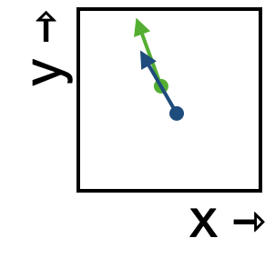

<!--
id: "cow-sharpen-linen"
created: "Fri Feb 20 07:56:17 2026"
attribution: DTK
status: "ready-to-use"
chapter: 12
mode: "exercise"
-->



::: {#exr-cow-sharpen-linen}


1. Which starting point---green or blue---will bring the state to the other flow arrow?

```{mcq}
#| label: flow-csl-1-lw
#| inline: true
1. green [hint: Sorry, but starting at the green point the flow carries the state away from blue.]
2. blue [correct]
```

2. Following the flow through this small region of space, which of the following best describes the shape of the trajectory?

```{mcq}
#| label: flow-csl-2-lw
#| inline: true
1. straight 
2. curved clockwise [correct]
3. curved counterclockwise
```

:::
 <!-- end of exr-cow-sharpen-linen -->
