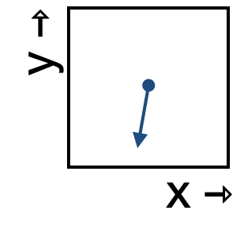

<!--
id: "cheetah-ring-clock"
created: "Fri Feb 20 07:38:40 2026"
attribution: TBA
status: "draft"
chapter: 1
mode: "exercise"
-->



::: {#exr-cheetah-ring-clock}


1. Which of these best describes the change in the x-component of the state as it moves through this region of state space?

```{mcq}
#| label: flow-crc-1-3k
#| inline: true
1. decreasing quickly
2. decreasing slowly [correct]
3. not changing
4. increasing slowly
5. increasing quickly
```

2. Which of these best describes the change in the y-component of the state as it moves through this region of state space?

```{mcq}
#| label: flow-crc-2-kus
#| inline: true
1. decreasing quickly [correct]
2. decreasing slowly 
3. not changing
4. increasing slowly
5. increasing quickly
```

:::
 <!-- end of exr-cheetah-ring-clock -->
