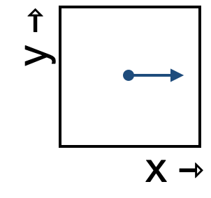

<!--
id: "gator-walk-piano"
created: "Fri Feb 20 07:41:15 2026"
attribution: TBA
status: "ready-to-use"
chapter: 13
mode: "exercise"
-->



::: {#exr-gator-walk-piano}

1. Which of these best describes the change in the x-component of the state as it moves through this region of state space?

```{mcq}
#| label: flow-gwp-1-8e
#| inline: true
1. decreasing 
2. not changing
3. increasing [correct]
```

2. Which of these best describes the change in the y-component of the state as it moves through this region of state space?

```{mcq}
#| label: flow-gwp-2-kus
#| inline: true
1. decreasing 
2. not changing [correct]
3. increasing 
```

:::
 <!-- end of exr-gator-walk-piano -->
