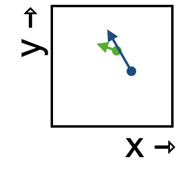

<!--
id: "nephew-do-screen"
created: "Fri Feb 20 07:32:40 2026"
attribution: DTK
use: Drill dynamics
status: "ready-to-use"
chapter: 13
mode: "exercise"
-->



::: {#exr-nephew-do-screen}



1. Following the flow through this small region of space, which of the following best describes the shape of the trajectory?

```{mcq}
#| label: flow-nds-1-jw
#| inline: true
1. straight 
2. curved clockwise 
3. curved counterclockwise [correct]
```

2. Which of the following best describes the speed of movement through the state-space region?

```{mcq}
#| label: flow-nds-2-xls
#| inline: true
1. steady speed
2. speeding up
3. slowing down [correct]
4. not enough information
2. blue [correct]
```
:::

:::
 <!-- end of exr-nephew-do-screen -->
