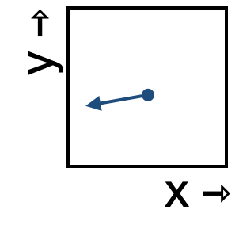

<!--
id: "oak-ring-socks"
created: "Fri Feb 20 07:54:55 2026"
attribution: TBA
status: "ready-to-use"
chapter: 13
mode: "exercise"
-->



::: {#exr-oak-ring-socks}


Which of these best describes how fast the state will move through this section of space?

```{mcq}
#| label: flow-ors-1-sy
1. The state moves slowly.
2. The state moves quickly.
3. No way to say. [correct hint: Right! It is only by comparison that we can say one arrow is "fast" and another "slow".]
```

:::
 <!-- end of exr-oak-ring-socks -->
