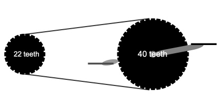

Many people are familiar with the complicated mechanical arrangement of the rear wheel of a bicycle: a cluster of several gears of different sizes and a mechanism to shift between them. 

::: {#fig-bike-gears}


A cluster of gears on the rear wheel of a bicycle. [Source](https://www.bicycling.com/bikes-gear/a46362781/how-bicycle-gears-work/)
:::

A common understanding of bicycle gears goes like this: Some gears are easy, some are hard. You shift to an easier gear when it's too hard to pedal, as when going uphill. You shift to a harder gear when the pedaling is too easy. If you are in too easy a gear, you'll be going unnecessarily slow.

In this essay, we will build a model of bicycle gears. We'll divide up the task chapter by chapter, expanding the model as we develop a better understanding of quantitative reasoning. 

Chapter 1: Modeling

Two important ideas from this chapter are

1. The purpose for the modeling effort is important. Models well suited to one purpose may be useless for another. 

2. We build models of *systems* which are collections of interconnected elements. 

Our purpose here is to better understand the relationship between things we describe with everyday words such as speed, force, effort, power, and such. These words are related and our modeling process will gradually reveal how and which aspects of them contribute to some gears being better than others in any situation of incline, wind, and speed. 

Our purpose in doing so is to understand what it is about bicycles and people that creates a need for gears. That is, why do bicycles have gears?

Chapter 2: Quantities

Each of the bike-gear-related words---speed, force, power, cadence, gear ratio---represents a quantity. Naming them is just a start. It will help in understanding them to know how they can be operationalized and what is the dimensionality of each. 

We have a natural sensation of speed when riding a bike. This might be due to the wind blowing past our face or the blur of nearby objects along the road. Some bikes have speedometers, a device for quantifying speed. But this is not common.

Cadence is not so common a word. It refers how fast the rider is pedaling. The "fast" here is a different kind of thing than the "fast" of speed. You can be pedaling fast yet going slow, and pedaling slow yet going fast.

Force is another quantity we can sense. A bathroom or kitchen *scale* is a household device for measuring force. Many readers might object: a scale is for measuring *weight* not *force*. It's been only about 400 years since scientists---Newton especially---defined weight as a kind of force. Recognizing that definition is important to developing scientific literacy. But for now, just remember that force is operationalized by a scale.

Chapter 3: Rate

As a reminder, our bike-gear vocabulary list, at present, includes speed, force, power, cadence, and gear ratio. Each of these, except force, is a *ratio* of simpler quantities. Let's take them one at a time:

speed
: Consider watching the bike as it travels the distance between two marks on the road separated by 10 meters. Use a stop watch to measure the time elapsed between when the bike crosses the first mark until it reaches the second mark.. Distance is the *base quantity* with dimension L. Similarly time is the base quantity with dimension T. 
: The bike's speed in going between the two road marks is a rate. Generically, a rate is a ratio between two quantities, that is, one quantity divided by another. The quantity we call "speed" is distance travelled during the corresponding time interval: distance / time. This is a *derived quantity* with dimension L / T. 
: Speed always has dimension L / T. We could make up another closely related quantity by dividing time by distance, giving dimension T / L. This quantity also has a name: **pace**, as in "8-minute mile." If a runner takes 80 minutes to run a 10-mile course, the average pace is 80 minutes / 10 miles. We can easily simplify the numbers in the ratio---80 / 10---to produce the 8 in "8-minute mile." But we can't simplify the dimensions: they are T / L. The phrase "8-minute mile" is a colloquialism in the running world. More formally, it would be stated as "8 minutes per mile." 
: Speed and pace contain the same information but in a different format. Effective quantitative reasoning requires paying attention to the words used for each format. 

cadence
: The cadence of a bicycle rider is the number of complete revolutions of the pedal that the rider accomplishes in a "given time." A typical bike cadence is 60 revolutions per minute. This is exactly the same quantity as 1 revolution per second. The "per minute" or the "per second" is what is meant by the "given time." 
: The dimension of revolutions is [1]. Equivalent ways to say this: "revolutions is dimensionless," "the dimension of revolutions is dimensionless" (which sounds silly but is nonetheless correct), or, most simply, "[revolutions] = [1]".
: In writing out the dimension of cadence, we remember that the rate is revolutions divided by time, that is 1 / T, or, written with exponents, T^-1^. 
: As with "speed" versus "pace," we have "cadence versus period." The "period is how much time it takes to complete one revolution, that is T / 1. Cadence and period carry exactly the same information, but they have different dimensions.

gear ratio
: The name "gear ratio" is a reminder that it is a ratio. The word "ratio" should be enough to indicate that there are two other quantities involved. In the case of a bicycle gear ration, the two quantities describe 1) the gear ring attached to the pedals and 2) the gear on the rear wheel currently engaged with the chain. 
: @fig-gear-ratio shows two gears. For our purposes, the relevant quantitative description of the gears is the number of teeth placed around the circumference. The gear ratio is, perhaps obviously, the ratio of the number of teeth on pedal gear to the number on the rear-wheel gear. In @fig-gear-ratio that is 40 teeth / 22 teeth. The number in the ratio is 40 / 22 = 1.8182. The unit of the ratio is teeth / teeth, which cancels out to [1]. Thus, the gear ratio is dimensionless.
: It would be equally valid to frame the ratio as 22 teeth / 40 teeth, that is 0.55. It seems odd to say that 1.8182 and 0.55 have the same information but in different formats. Sometimes it is helpful to keep track explicitly of how the ratio is formed, for instance 1.8182 (front/rear).

::: {#fig-gear-ratio}


Schematic diagram showing two gears connected by a chain. The right-most gear is attached to the pedals, the left-hand gear is attached to the rear wheel. 
[Source](https://demonstrations.wolfram.com/BicycleGearRatiosAndMetersOfDevelopment/)
:::

The above three quantities---speed, cadence, gear ratio---are all defined in terms of a simple ratio of base quantities. "Force" is different. There are many ways to think about force. The dimension of force is M L T^-2^. One way to construct this dimension is to think about weight, which is a kind of force. Newton's Second Law of Motion states that force is mass time acceleration. For the weight of some object, the "acceleration" is that due to gravity, which near the surface of Earth is approximately 9.8 meters per second per second, or, more compactly, 9.8 m/s^2^.

In the case of the bicycle rider, the force exerted by the rider is produced by the rider's muscles; it does not directly involve gravity. Even muscle force, however, can be measured with a scale. 

Notice that we started with the simple word "force." Applied to the bicycle situation, this got related to "muscle." Eventually, we will have to include some description of muscle in the model.

Chapter 5: Functions

We will be using *functions* to represent the connections among the quantities in the model. Before trying to write down these connections as mathematical formulas, the modeler should sketch out a hypothesis about the connections, that is what the inputs and outputs will be. 

::: {#fig-force-to-speed}
```{mermaid}
graph LR
  A(Speed)
  B(Force on pedal)
  B --> A

```

A model that will turn out to be too simple to be useful.
:::

@fig-force-to-speed shows a very simple model. The force that the rider puts on the pedal determines how fast the bike goes. This accords with intuition: the harder you push the faster you go. But it is too simple for our purposes.

Why? The purpose of our model is to help us understand why bicycles have gears. There's no gear ratio included in @fig-force-to-speed. 

The more elaborate model of @fig-gear-human shows the role of gear ratio in connecting pedal force to speed. This model places several quantities as *intermediates* between force and speed.

::: {#fig-gear-human}
```{mermaid}
graph LR
  A(Speed)
  B(Pedal cadence)
  C(Wheel circumference)
  D(Wheel cadence)
  F(Gear ratio)
  G(Force on pedal)
  B --> D
  F --> D
  D --> A
  C --> A
  G --> B
  


class E exogenous
class G exogenous
class H exogenous
```

Some of the quantities in the bike-gear-rider-road system. They are all interrelated. Arrows have tentatively been added between nodes. Other choices are certainly possible.
:::

The speed of the bike is related to two simple quantities: the circumference of the wheel (dimension L) and the rate of revolution of the wheel, which we can quantify as the "wheel cadence," the number of cycles per second of the wheel (dimension T^-1^). Each single revolution of the wheel moves the bike forward by a distance equal to the circumference of the wheel. 

We have a huge hint about the function that takes wheel cadence and circumference as inuts and produces speed as output. The only arithmetic operations that can combine quantities with different dimensions are multiplication and division. We choose the operation to give the dimension of the output. Being speed, the output dimension is L T^-1^. You can try all the possibilities, but you may also be able to see at a glance that multiplying cadence (T^-1^) by circumference (L) gives L T^-1^.

The wheel cadence is determined by the pedal cadence and the gear ratio. Here, dimensional analysis helps to confirm what the functional form should be that take pedal cadence (dimension T^-1^) and gear ratio ("dimensionless", that is [1]) to produce wheel cadence. The inputs have different dimensions so the only arithmetically allowed combinations are multiplication or division. Petal cadence should be on top, but the arithmetic would allow either multiplication or division by gear ratio. Which one is correct depends on the details of how gear ratio was defined.

EXERCISE: Look at the definition of gear ratio (introduced under Chapter 3) and figure out whether to multiply or divide pedal candence by gear ratio in order to produce wheel cadence. 

Chapter 6: Core modeling functions

It is important to keep in mind that modelling is a *process*, not just a result. The model in @fig-gear-human shows several plausible quantities and relationships among them, but it is still missing an important concept critical to answering the question of why bicycles have gears, the concept of **best**.

The bike rider selects a gear ratio, out of the several available on the bike's rear cluster of gears, that produces the *best* result in terms of riding in the given conditions. Intuition suggests that there are two objectives that influence the choice of gear: 1) generating a desired *speed* for the bike and 2) reducing the bicyclist's *effort* to a minimum. 

We need to introduce to the model an element that gives scope to express the notion of "best." For the reader, lacking experience in modeling, it may be far from obvious how to do this. Bringing in the voice of experience, I'll suggest how to think about "best" in terms of the shape of a function.

Consider the hill() function which, like all functions, relates inputs to an output. 

::: {#fig-bike-hill-fun .column-margin}

NEED TO REDRAW THIS to replace the x-axis scale with a label argmax.
The hill() function reaches its maximum output for a single value of its input called the **argmax*. SHOULD I ADD A "Best" chapter?

:::

Talk about the KIND OF STORYBOOK FUNCTION THAT PRODUCES a "best" result. 


WE WANT TO RELATE the human input to the bicycle output. We know where gear ratio fits in. We need to add in a road resistence, which can be a stand-in for all the other factors that relate speed to effort.


Work out the relationship between cadence, gear ratio, and speed? What quantity is needed to be able to make a complete description (wheel circumference)?

THE FOLLOWING WERE ORAL NOTES.

other people stick with gearless bicycles in this modeling problem. We’ll look at the question why or why do bicycles have gears we’re going to build a model of how bicycles work along with their human riderand the environmental factors such as wind and hills we’ll introduce the model and then as we encounter each chapter we will bring in the tools from that chapter to help us develop the model and through the model our understanding of why bicycles have gears
and the environmental factors such as wind and hills we’ll introduce the model and then as we encounter each chapter we will bring in the tools from that chapter to help us develop the model and through the model our understanding of why bicycles have gears And the environmental factors such as wind and hills we’ll introduce the model and then as we encounter each chapter we will bring in the tools from that chapter to help us develop the model and through the model our understanding of why bicycles have gears

Chapter 1.
 Our model will be a system like all systems. It’s composed of multiple elements and like most models it will leave out a lot.  You probably know a lot of vocabulary pertaining to bicycles and riding. For example, you know that it takes effort to ride a bike. It’s more effort when you’re riding uphill and less sometimes much less effort when you’re riding downhill but what does the word “effort mean?” Another word probably similar Similar in your mind to effort is energy another word power and of course you’re familiar with speed how fast the bicycle is going you know that hills are described in terms of inclines and if you pay attention while you ride, you know that as you push on the pedals and they go round and round You have A certain cadence a number of cycles per second that you move the move the pedals around their circuit and you may know that the gear attached to the pedals is connected by the chain to some other gears attached to the rear wheel. It’s these other gears that were interested in why is there more than one gear in back? What purpose does it serve
why is there more than one gear in back? What purpose does it serve why is there more than one gear in back? What purpose does it serve?

Chapter 2.

The bicycle words we mentioned in the first chapter speed, cadence effort energy are all quantities. In order to use them as quantities we need to have a precise measurable definition of what each one is we can’t quantify something unless we know what it is. Let’s start with cadence as you pedal your feet go round and round. We’ll define cadence to be the number of cycles that your feet go in one second you probably have a good idea of a typical bicycle cadence about one cycle per second. It might be a little faster. Might be a little slower. The dimension of cadence is one over time.

The bike speed is also pretty fundamental a typical speed for a casual rider maybe 5 to 10 miles per hour sometimes going to 20 miles per hour down a hill. Athletes can ride much Faster. The dimension of speed is length per time as in miles per hour.  

The quantitative expression of words like effort, energy force, and such our interlinked in a particular standard way to some extent the words used to express these concepts are arbitrary, but they are so important that there is a standard definition for each of them.

Let’s start with force. You can sense the force with which you push on the pedal. But how would you measure it?  Quantifying force is what a scale does as in a scale for measuring body weight or the weight of fruits in a grocery store. The idea is that an older order to hold the weight steady. You have to apply force against gravity, That is the gravitational force on the object. Newton had the idea that gravity left unopposed will accelerate a weight as it Moves downward. Before we can talk about acceleration, we need the concepts from chapter 3. But intuitively you already know that the amount of force Of an object under the influence of gravity is proportional to the “size“ of the object. Scientists quantify this size as mass. The more mass, the bigger the force.  


