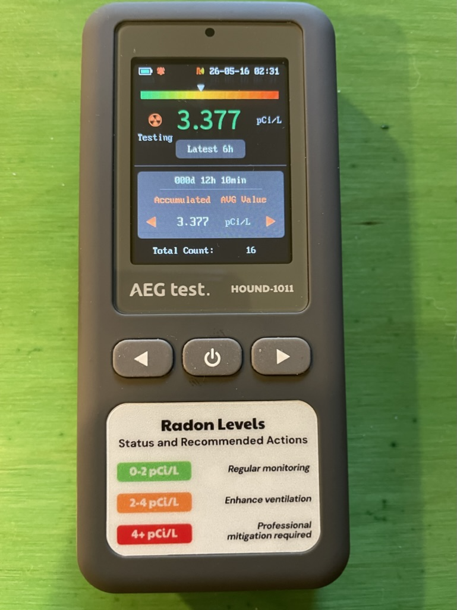
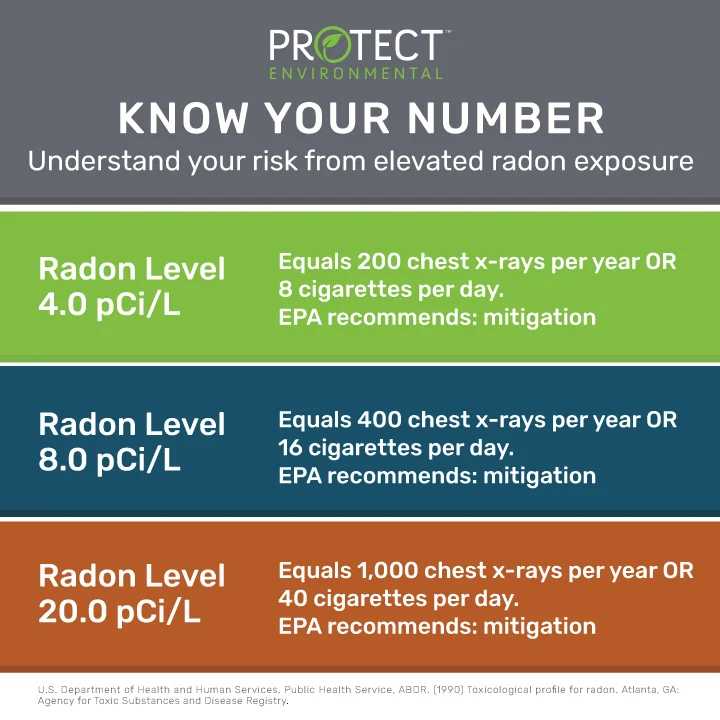

A friend, a board-game designer who works out of his basement, recently discovered unacceptably high levels of radon. Radon is a radioactive gas; exposure is a risk factor for lung cancer even among non-smokers. Radon is a natural product, deriving ultimately from the uranium that has been part of the Earth's material since our planet's formation. 

The radon level in my friend's basement was XXX pCi/L. The level is a physical quantity and therefore has units, just as volume and velocity have units of, say, liters and miles per hour. The detector presents the quantity as picocuries per liter.

::: {#fig-radon-detector}

The radon detector used by my friend.
:::

You hardly have to know what a picocurie is in order to interpret the quantity shown by the detectors. There is a label on the detector that tells you what to conclude. XXX translates to the red level: "Professional mediation required." Even the lowest level on the label, colored green, suggests that you would not be out of the woods, but instead need to monitor regularly. These thresholds were established by the US Environmental Protection Agency and are repeated widely on the internet and by AI.

At my friend's urging, I borrowed his detector to use in my basement. The reading was 3.377 pCi/L. At this level, the label recommends, "Enhance ventilation." 

Important matters for a successful quantitative reasoner: Do I have enough information to make an informed decision? What sort of additional information would I need? Here are four perspectives:

1. Mathematics perspective: This is a 5th-grade math problem. One needs only to decide which action category---green, orange, or red---applies. All the necessary information is available.

2. Statistical perspective: How precise is the measurement? Common sense says that 3.377 is precise; changing the last digit would not change the decision outcome. But common sense is wrong here. The detector's designers have committed quantitative malpractice by pretending that one number---3.377---is enough. Instead, there should be at least two numbers, the lower and upper values of an uncertainty interval based on the evidence provided. Here, that range is 1.9 to 5.1. Since this range spans all three action categories, the evidence doesn't point strongly to any one category.

Where does that range come from? This is, at best, the *second* question a quantitative reasoner should ask. The *first* question is, what is the interval itself. It is the designers of the detector who ought to be providing that interval. It's unreasonable and unnecessary to expect the end-user to do the calculations. Instead of 3.377, the display should read 1.9 to 5.1. An expert can calculate this based on the information collected by the detector, the "total count" of 16. 

We would never expect the end-users of the detector to be able to conceive, design, and build the detector itself. Similarly, we shouldn't expect the end-user to do the calculations needed for a meaningful display, which is in a universal format applicable to many settings, not just radon. Statistics students learn how to calculate the uncertainty interval in a handful of simple settings. That is, I think, part of an appropriate pedagogy for teaching what such an interval is and why it's needed. But the calculations are not needed to understand what's important: That there is such a thing as an uncertainty interval and how to use it in the face of a decision like the one we need to make here.

3. Physical perspective: A huge clue to interpreting the data comes from the physical units of the quantities: pCi/L, that is, picocuries per liter. Although it is helpful to know exactly what a picocurie is, more basic information will do the job for the decision maker. We can rely on experts, trained specialists, to keep track of the details. @fig-radon-risk-quide is an example of the work of such specialists, a translation of the obscure unit pCi/L into more everyday terms.

::: {#fig-radon-risk-guide}

Translating radon levels into "equivalent" numbers of chest X-rays per year or cigarettes smoked per day. Information from US HHS Dept. toxicological profile for radon, agency for toxic substances and disease registry. [Image source](https://www.protectenvironmental.com/understanding-radon-measurement-what-is-pci-l/)
:::

The experts have done their job well in choosing everyday contexts to stand for radon exposure: chest x-rays per year and cigarettes smoked per day. A chest x-ray is a familiar, worthwhile exposure to radiation. What risk? Many people know that the x-ray technician steps out of the room or puts on a lead apron when the picture is taken. The technician might take 2000 such pictures per year, so the technician's dose needs to be much smaller than allowed for the unprotected patient getting the occasional x-ray. People without specific symptoms might have a chest x-ray once every five years. So 200 pictures per year seems to be something significant. 

Cigarettes per day are relevant because 1) many people have a sense of what it means to smoke heavily, say one pack per day (20 cigarettes) and 2) smoking causes lung cancer. Lung cancer is a primary mechanism for morbidity and mortality from radon exposure.

The successful quantitative reasoner needs to know to look for a particular aspect of the units provided, whether they be pCi/L or X-rays per year or cigarettes per day. This aspect is hidden by the obscurity of pCi/L, although a person knowing what to look for could easily find it from a web search.

The aspect I'm talking about is the **dimension** of the unit. Here, "dimension" doesn't refer to the 2-D nature of a screen or the 3-D of the physical space we move through. Instead, the dimension of relevance to units is a systematic way to express what the unit is about in terms of simple, specific physical quantities from which other quantities are constructed. For instance, length (L) and time (T) are simple dimensions. Others are mass (M) and count (N). To illustrate, *distance travelled* has dimension L, but *speed* has dimension L/T. This is easy to see in common units used for speed, for instance "miles per hour," that is, "miles" (L) divided by "hours" (T). 

Cigarettes per day and X-rays per year both have dimension N / T: that is, they are **rates**. They are as much about time as they are about the number of cigs or x-rays. It's understandable if the name picocurie does not bring to mind time as a dimension, but in fact its dimension is N / T, which is way cigarettes and X-rays provide a good analogy.

The T is critically important. Smoking a pack of cigarettes per day over an interval of one month is not as harmful as smoking at that rate for 10 years. Similarly, radon exposure in a basement in which you spend 30-minutes each day is not as harmful as radon exposure in a basement in which you spend hour after hour.

My game-designer friend spends hours each day in the basement workshop. I spend a few tens of minutes in my basement, playing ping-pong or retrieving something from the basement fridge. The rest of the time, I spend on the ground floor or in the bedrooms upstairs. The exposure to radon is much lower in those places. The radon detector's reading is 0.2 to 1.6 pCi/L on the ground floor. (The device shows the raw data: 0.837 pCi/L with 7 counts.) 

As a worst case analysis, I'll use the upper bounds to the uncertainty intervals: 5.1 pCi/L for the basement and 1.6 pCi/L on the ground floor. I spend only about 0.5 hour/day in the basement and 23.5 hour/day upstairs (or outside, where radon levels are typically much lower). On average, my exposure---worst-case---works out to be
$$(5.1\ \text{pCi/L}\ \times 0.5 \text{hr}\ \ + \ \ 1.6\ \text{pCi/L}\times 23.5\ \text{hr})/24\ \text{hr} = 1.7\ \text{pCi/L}\ .$$ 

Overall exposure: well within the green category. 

4. Cost/benefit perspective. Remediating radon exposure might be close to free, for example by moving my workspace upstairs. Or, I might have to pay extra heating costs or installation costs for "professional remediation." But for this cost, I get some benefit: less risk of lung cancer from radon.

A guide used by many epidemiologists is **number needed to treat** (NTT), that is, how many people (or houses) need to be treated to save one life. Looking at the cost of treatment, gives a quantity in terms of dollars per life. $700,000 per life for radon remediation shows up on the internet, but this is based on many unstated assumptions about risk and cost. 

The dimension here is W/N, where W is the symbol I use for "worth" or "money." This isn't a crass equating of human life with money, even though the units may look that way. Instead, it is to be compared with W/N for other health and well-being interventions. If there are more efficient ways to spend that money, shouldn't I do so?

I'll save discussion of the cost-benefit perspective for cases where we have better estimates of cost and benefits. But I will point out that the quantitative reasoner should be skeptical of the applicability of the dimension W/N. It's reasonable to think that the proper measure of benefit is not the number of lives, but the amount of extension of lives. Such extension ought to be measured in its proper dimension: T. A unit of this dimension is, for instance, "life-years." There are important consequences to the choice. W/N tends to focus concern on older people, for whom there are many interventions that might save a life (for a little while). Using W/T would emphasize interventions that reduce child mortality, since the youngster's saved life plays out over many years.

